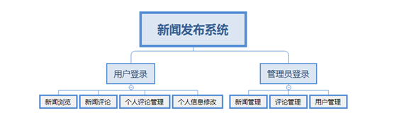

# newsPub
基于jsp+servlet的MVC开发模式新闻发布系统

本项目是javaWeb综合实验项目，课本版本是李永飞等人著。

本项目遵循书上的开发需求，但较书上内容有较多扩展。期待华北科技学院的学弟学妹们节俭实用，

因为老师要求的jsp+servlet+mvc模式，所以不打算继续扩充为框架版本。谨以此项目训练自己的javaweb基础

系统分为前端面向用户的新闻系统和面向管理的管理系统。

前端系统需求分析：

1、	用户注册功能；
2、	用户登录功能；
3、	用户信息修改功能；
4、	浏览新闻功能；
5、	评论功能；
6、	评论管理功能；
7、	新闻分类显示；

   管理系统功能：
   
1、	管理员登录跳转管理页面；
2、	管理员进行新闻内容的增删改查；
3、	管理员对用户的查询、删除、修改功能；
4、	管理员对评论的查询和删除功能；

系统功能结构图

搭建环境：

前端：BootStrap前端框架、HTML、CSS、JavaScript、JQuery框架

后端：Java、MySql数据库、Tomcat服务器

架构：B/S架构，MVC开发模式

开发工具：IntelIDEA

使用的工具：BeanUtils、fastJson、c3p0、dbutils